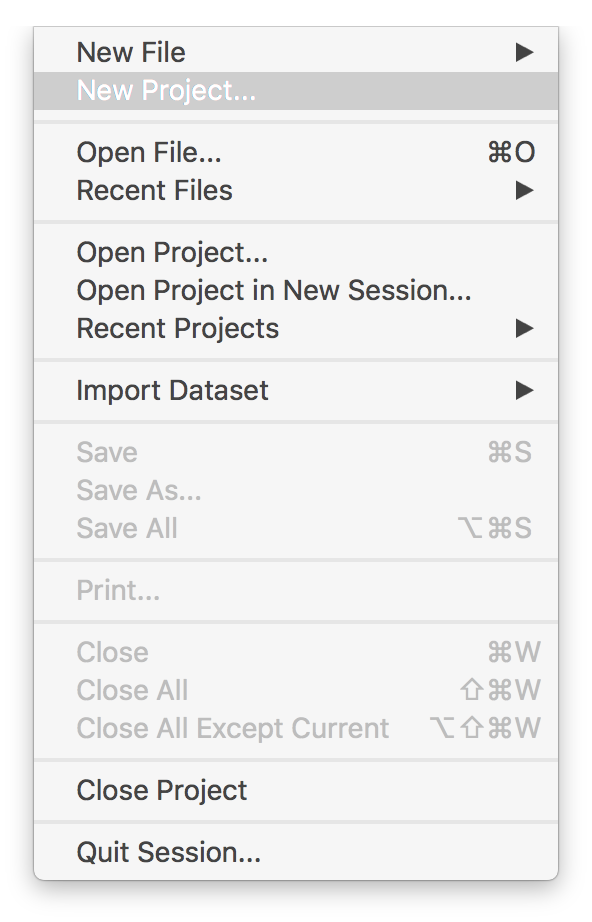
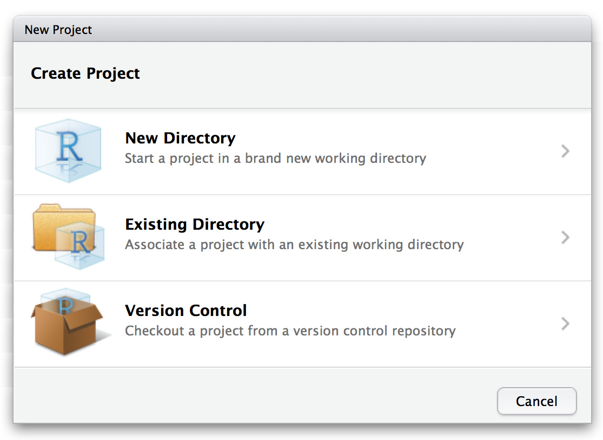
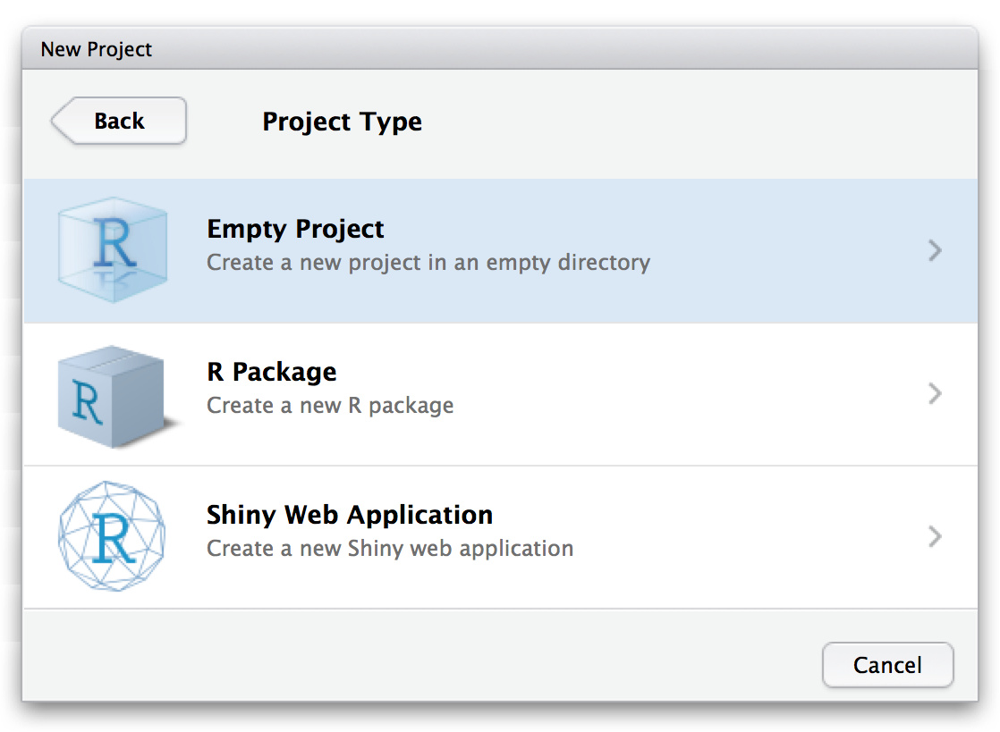
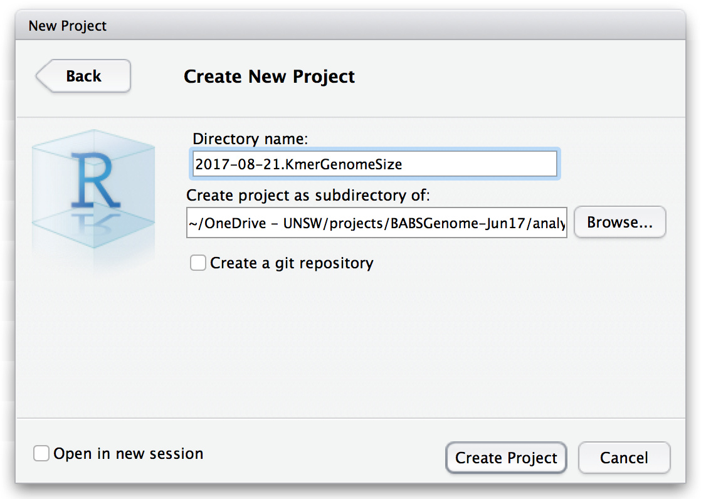
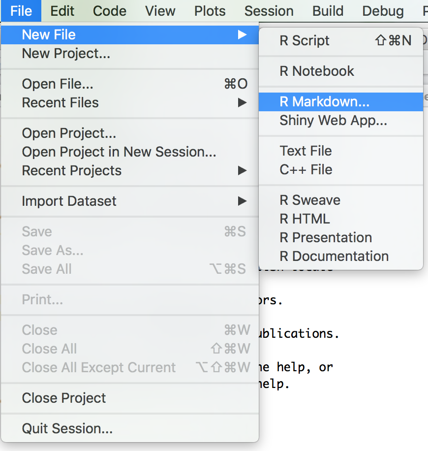
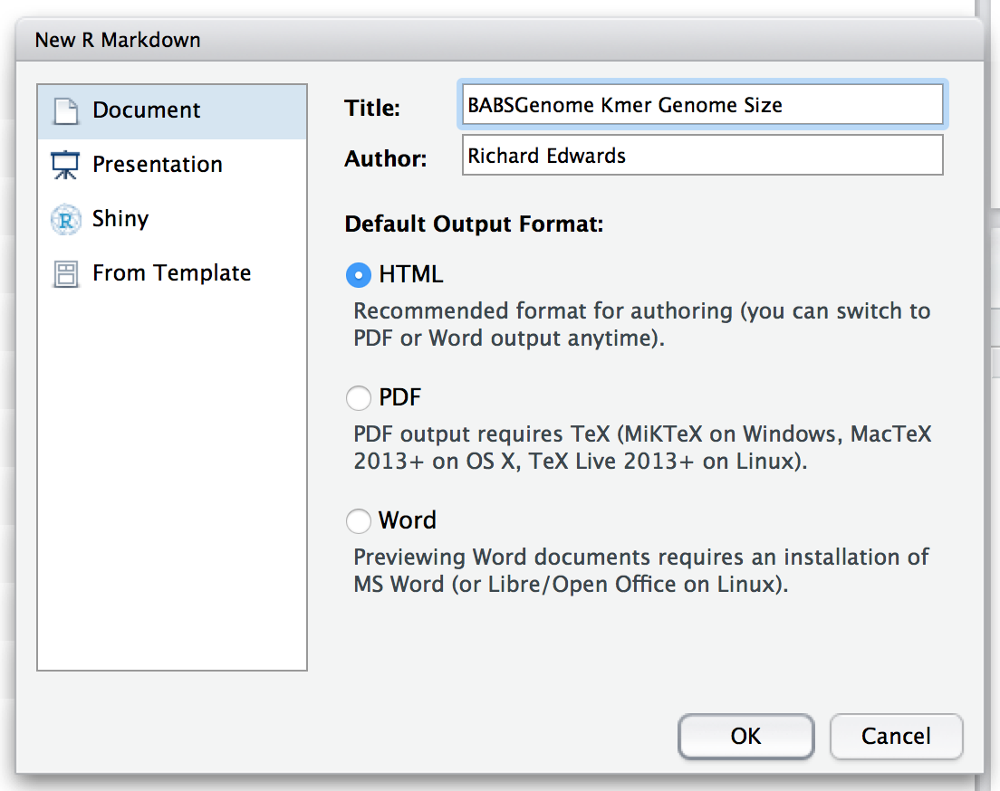

```{r setup, include=FALSE}
knitr::opts_chunk$set(echo = TRUE)
```

## R Markdown

This is an R Markdown document. Markdown is a simple formatting syntax for authoring HTML, PDF, and MS Word documents. You can access a good summary of the syntax recognised by RMarkdown here: <http://rmarkdown.rstudio.com/authoring_basics.html>. You can also look at this document in RStudio and see how various bits were created. Better still, experiment!

When you click the **Knit** button a document will be generated that includes both content as well as the output of any embedded R code chunks within the document. You can embed an R code chunk like this:

```{r cars}
summary(cars)
```

You can also include R code that is executed but not output to the knitted document using `echo=FALSE`, e.g. `{r pressure, echo=FALSE}`.

**NOTE:** Each block of r code needs a unique label (`cars`, `pressure` etc.), otherwise you will get a `duplicate label` error. You can also leave out the label, e.g. `{r}`.

**Why R Markdown?** The benefits of R Markdown over a plain R Script are that you can document your analysis clearly, which avoids the need for a separate analysis and write-up. This keeps the analysis directly tied to its background and interpretation, which is good for reproducibility.

**Why _not_ R Markdown?** Complex analyses can sometimes get a bit slow in R Markdown. When you get more experienced with R, you might also want to make some scripts that can be run from the commandline.

## Setting up your project

Life can be made a bit easier by keeping your code and files together in an **R Project**. Set up a new Project (**`File -> New Project...`**):



If you have already created a directory (and possibly copied data), select **Existing Directory**, otherwise create and **Empty Project** in a **New Directory**:




If you need to, refresh your memory of the **File Organisation** rules in the **Overview** section of your LabArchives notebook. The make an appropriate `analysis/` subdirectory for your project:


Now make a new R Markdown file (**`File -> New File -> R Markdown...`***) and give it an appropriate Title:




RStudio will create a file with a few markdown elements to help you start your document. **Save** it under an appropriate name, e.g. `KmerGenomeSize.2017-08-21.Rmd`, and see what happens when you **Knit** it into HTML.

When returning to this analysis in a future session, you should be able locate your `*.Rproj` file and double-click to open it in RStudio. From the **Files** pane, you should then be able to click on your `*.Rmd` file to open it in the editor window.

**NOTE:** You can have multiple R Markdown files in the same project. This can be useful if you want to execute a few different analyses and/or save a backup before a major edit.

## Predicting genome size from kmer analysis

We are now going to do some simple kmer genome size prediction, following [an online tutorial](http://koke.asrc.kanazawa-u.ac.jp/HOWTO/kmer-genomesize.html) by T. Nishiyama of Kanazawa University: <http://koke.asrc.kanazawa-u.ac.jp/HOWTO/kmer-genomesize.html>. This runs some simple R code on the output of a program called [Jellyfish](http://www.genome.umd.edu/jellyfish.html). We have already run Jellyfish a few times on some of our snake data. The `*.histo` files can be found in `/share/data/babsgenome/jellyfish/`.

Use **FileZilla** to copy the contents of `/share/data/babsgenome/jellyfish/` to your Windows machine. Ideally, you will create a `data/` directory for these. This will make the R code slightly more complicated than in their example. If you really struggle to load the data, you can also copy the files into your project directory. (If you do not have a good file organisation system, this is a good because it keeps the data with the analysis code. However, it can also lead to a lot of unneccessary duplication of files.)

### Background

In essence, kmers are 

### Kmers, the theory

You received a general introduction to **kmers** and genome size prediction at the tutorial on Friday. A kmer is a stretch of DNA of length `k`. The general idea behind kmer analysis is that, in the absence of any repeat sequences, each position in the genome will be the start of a unique kmer. For example, for `k=21`:

```
CCACCCACCCAGATCGAAATCTGATCTGAT...TCACGTTTCAAAGGCCGGCGTGGGTC
CCACCCACCCAGATCGAAATC
 CACCCACCCAGATCGAAATCT
  ACCCACCCAGATCGAAATCTG
                  ...               CGTTTCAAAGGCCGGCGTGGG
                                     GTTTCAAAGGCCGGCGTGGGT
                                      TTTCAAAGGCCGGCGTGGGTC
```

For this to be true, `k` needs to be large enough such that the theoretical number of different kmers far exceeds the genome size. For example, versus a human genome (3 GB, red line):

```{r ktableplot}
barplot(log10(4**c(1:27)),xlab="k",ylab="log10 unique kmers",names.arg=1:27)
abline(h=log10(3e9),col="red")
```


### Jellyfish

For this prac, we have used a program called [Jellyfish](http://www.genome.umd.edu/jellyfish.html). Jellyfish finds all of the kmers in a set of sequences for a given `k`. These are output into a big file from which it is possible to extract counts for individual kmers or to generate a "kmer distribution". The data in `/share/data/babsgenome/jellyfish/` are examples of this latter output. These "histogram" files contain the number of different kmers found at each frequency, e.g. the number of different kmers found once, twice, three times etc. (See the [Jellyfish user guide](http://www.genome.umd.edu/docs/JellyfishUserGuide.pdf) for more details.)

**NOTE:** When plotting these data, we use `plot()` rather than `hist()` evenn though it is "histogram data". This is because Jellyfish has already transformed the raw data into counts. `hist()` is used when you need to performing the "binning" of data itself. (See R help for details.)

**Our Jellyfish files.** We ran `jellyfish count` with the `-C` option for a variety of trimmed input snake fastq files. These can be broadly split into three runs:

1. `*..mer_counts.histo` = Early runs with `k=21` on minimally trimmed (adaptors and Q10 quality trimming) data for the Mother, Father and Child snake. Output is by lane `L001`/`L002` or combined (no L given).

2. `TS_Mother_S1.truGQ25.k*.histo` = The trimmed Mother snake data used for assembly were run with a variety of `k` settings.

3. `TS_Mother_S1.truGQ*.k25.histo` = Mother snake data with a few different Quality trimming settings were run with `k=25`.

### Basic genome size calculation

Now visit the [online tutorial](http://koke.asrc.kanazawa-u.ac.jp/HOWTO/kmer-genomesize.html) and see if you can work through the process on one of the `*.histo` files from the server. (Pick any one.) Rather than run from the commandline as in the tutorial (**Plot graph with R** onwards), put your R code inside your R Markdown document and add some discussion of the results in Markdown. Think about whether you should use different R variable names.

**Challenge:** Rename your data frame fields to be more useful. Add better axis labels to your plots. (**HINT:** `colnames()`, `xlab=` & `ylab=`)


**QUESTION:** Do you get the same answer for a single lane of sequencing versus using both lanes?

**QUESTION:** Do you expect the three snake samples to give the same answer? Do they?

## GenomeScope

Now load the same data into the GenomeScope server that we looked at in the tutorial. Does it give the same answer?

**Challenge:** Try running several different `*.histo` files through the simple method and GenomeScope, then create a scatterplot of GenomeScope predictions versus the simple predictions. 

**Challenge:** See if you can use a `for(...){ ... }` loop in R to process several `*.histo` files in one go.

**Challenge:** Plot how predictions for both methods change on the `TS_Mother` data with (a) different `k` settings, and (b) different quality trimming thresholds.

If you are new to R, you might want to come back to these challenges after doing the assembly statistic tasks.


