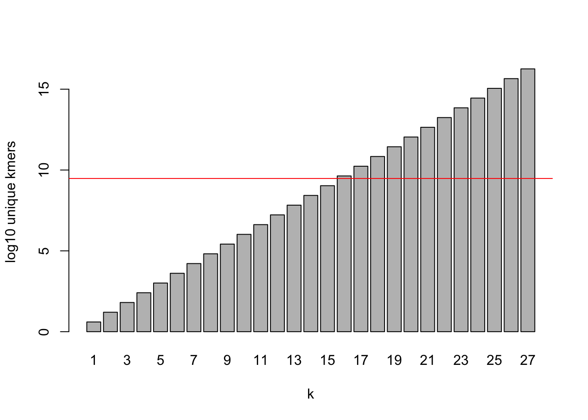
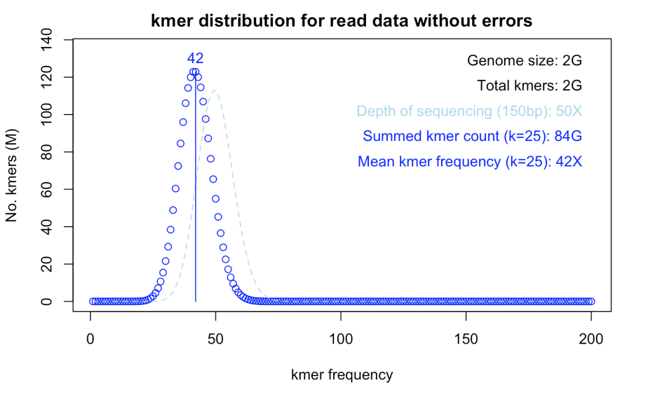
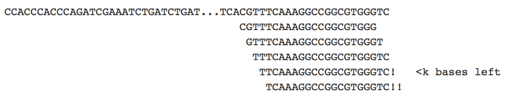
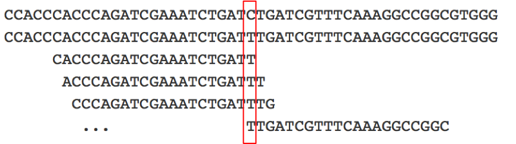
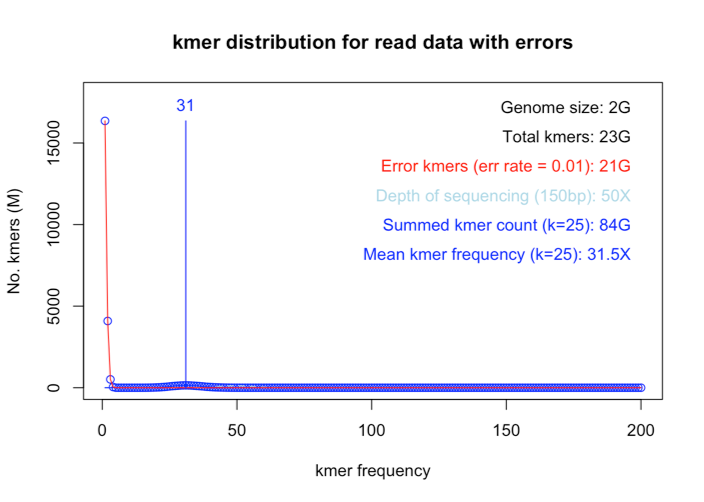
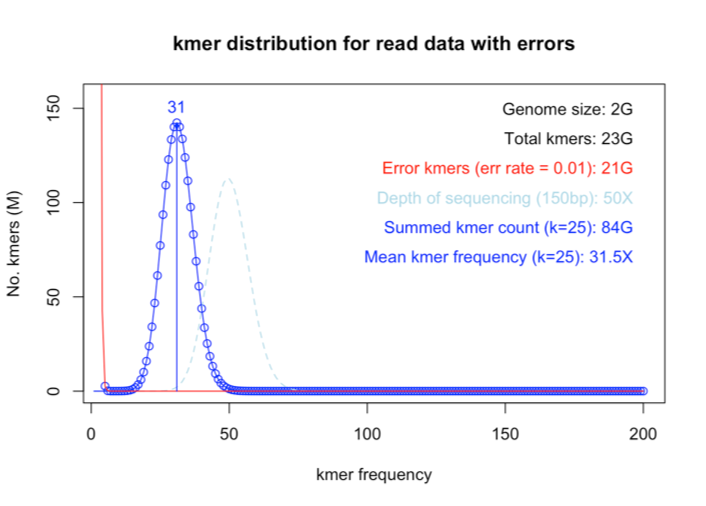
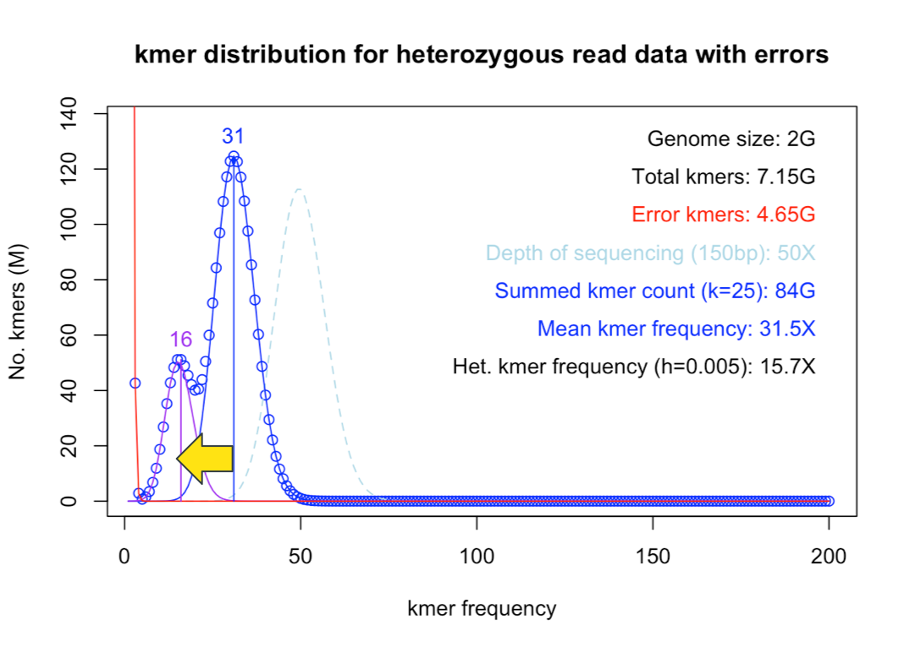
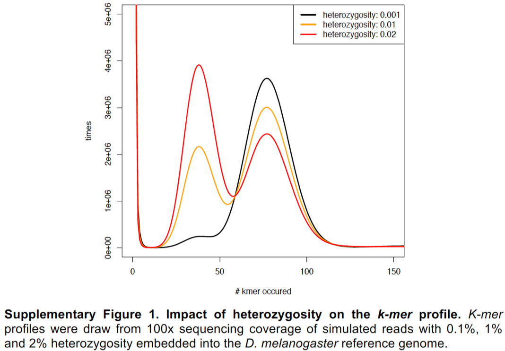
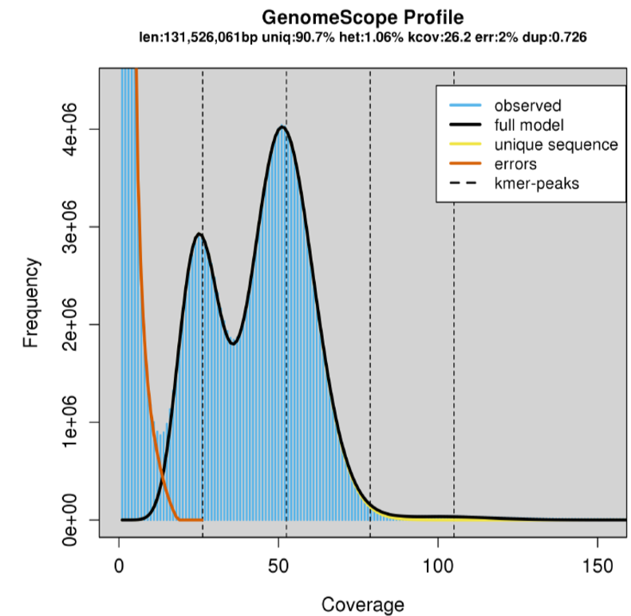
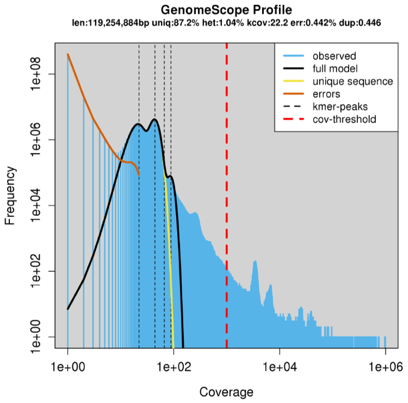

# Kmer theory for genome size prediction

## Kmers, the theory

A kmer is a stretch of DNA of length `k`. For example, for `k=21`, each possible 21 nucleotide stretch in a DNA sequence is a kmer:

```
CCACCCACCCAGATCGAAATCTGATCTGAT...TCACGTTTCAAAGGCCGGCGTGGGTC
CCACCCACCCAGATCGAAATC
 CACCCACCCAGATCGAAATCT
  ACCCACCCAGATCGAAATCTG
                  ...               CGTTTCAAAGGCCGGCGTGGG
                                     GTTTCAAAGGCCGGCGTGGGT
                                      TTTCAAAGGCCGGCGTGGGTC
```

The general idea behind kmer analysis is that, in the absence of any repeat sequences, each position in the genome will be the start of a unique kmer. For this to be true, `k` needs to be large enough such that the theoretical number of different kmers far exceeds the genome size; in the example above, you can see that `k=7` would give two `CCACCCA` kmers in just the first stretch of nucleotides. The number of different possible kmers increases expontentially with `k`, so even the largest genome will be dwarfed by the possible kmers when `k` is big enough. For example, versus a human genome (3 GB, red line):



**NB.** To make this plot yourself in R:

```{r ktableplot}
barplot(log10(4**c(1:27)),xlab="k",ylab="log10 unique kmers",names.arg=1:27)
abline(h=log10(3e9),col="red")
```


## What contributes to a kmer distribution?

Theoretical (haploid) kmer profile is Poisson centred on depth of sequencing:




### Read length
Finite read lengths reduce number of kmers:



Ckmer= N*(L-k+1) / G
L = average read len
Nreads = No. reads
G = Genome size

`C`<sub>`kmer`</sub>

### Sequencing errors

Create false kmers and reduce effective average coverage
Each error affects k kmers








### Heterozygosity

Each SNP takes k kmers from the haploid coverage peak and makes 2k kmers at half the coverage





### PCR Duplicates

Artificially creates duplicate kmers
Reduces effective coverage
Increases variance of distribution




### Repeats

Repeats move kmers to > 2X (proportional to repeat no.)



Artificially over-represented kmers that distort distribution
Mitochondria etc.
GenomeScope has a max kmer frequency setting

